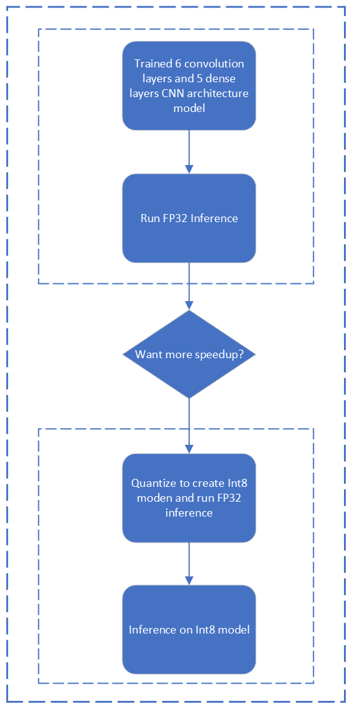

## **Application of AI in image-base abnormalities for different diseases classification using TensorFlow**

## **Table of Contents**
 - [Purpose](#purpose)
 - [Reference Solution](#reference-solution)
 - [Reference Implementation](#reference-implementation)
 - [Intel® Optimized Implementation](#optimizing-the-e2e-solution-with-intel%C2%AE-oneapi-components)
 - [Performance Observations](#performance-observations)

 <!-- Purpose -->
## Purpose

Medical diagnosis of image-base abnormalities for different diseases classification is the process of determining the abnormality or condition explains a person's symptoms and signs. It is most often referred to as diagnosis with the medical context being implicit.
Images are a significant component of the patient’s electronic healthcare record (EHR) and are one of the most challenging data sources to analyze as they are unstructured. As the number of images that require analysis and reporting per patient is growing, global concerns around shortages of radiologists have also been reported. AI-enabled diagnostic imaging aid can help address the challenge by increasing productivity, improving diagnosis and reading accuracy (e.g., reducing missed findings or false negatives), improving departmental throughput, and helping to reduce clinician burnout.


The most common and widely adopted application of AI algorithms in medical image diagnosis is in the classification of abnormalities. With the use of machine learning (ML) and deep learning, the AI algorithm identifies images within a study  that warrants further attention by the radiologist/reader to classify the diseases. This aids in reducing the read time as it draws the reader’s attention to the specific image and identifies abnormalities 

## Reference Solution

■ X-ray images are critical in the detection of lung cancer, pneumonia, certain tumors, abnormal masses, calcifications, etc. In this reference kit, we demonstrate the detection of pneumonia using X-ray images and how a CNN model architecture can help identify and localize pneumonia in chest X-ray (CXR) images.

■ The experiment aims to classify pneumonia x-ray images to detect abnormalities from the normal lung images. The goal to improve latency, throughput (Frames/sec), and accuracy of the abnormality detection by training a CNN model in batch and inference in real-time. Hyperparameter tuning is applied at training for further optimization. <br>

■ Since GPUs are the natural choice for deep learning and AI processing to achieve a higher FPS rate but they are also very expensive and memory consuming, the experiment applies model quantification to speed up the process using CPU, whilst reaching the standard FPS for these types of applications to operate, to show a more cost-effective option using Intel’s technology. When it comes to the deployment of this model on edge devices, with less computing and memory resources, the experiment applies further quantification and compression to the model whilst keeping the same level of accuracy showing a more efficient utilization of underlying computing resources <br>

## **Key Implementation Details**

■ In this refkit we highlighted the difference of using Intel OneAPI packages specially TensorFlow against the packages that of stock version of the same packages.<br>

■ In this refkit we use a CNN model architecture for image classification based on a dataset form healthcare domain.The CNN-based model is a promising method to diagnose the disease through X-ray images.
The time required for training the model, inference time and the accuracy of the model are captured for multiple runs on the stock version as well on the Intel OneAPI version. The average of these runs are considered and the comparison have been provided.

■  Model has been quantized using Intel® Neural Compressor and Intel® Distribution of OpenVINO™ Toolkit, which has shown high performance vectorized operations on Intel platforms

## Reference Implementation

### ***E2E Architecture***
### **Use Case E2E flow**


### Expected Input-Output

**Input**                                 | **Output** |
| :---: | :---: |
| X-ray Imaged data (Normal and Infected)          |  Disease classification

**Example Input**                                 | **Example Output** |
| :---: | :---: |
| <b>X ray Imaged data based on patient's complain <br></b> Fast breathing, shallow breathing, shortness of breath, or wheezing, Patient reports pain in throat, chest pain. fever and loss of appetite over  the last few days. | {'Normal': 0.1, 'Pneumonia ': 0.99}

### Reference Sources
*DataSet*:https://www.kaggle.com/datasets/paultimothymooney/chest-xray-pneumonia<br>

*Case Study & Repo*: https://becominghuman.ai/image-classification-with-tensorflow-2-0-without-keras-e6534adddab2

### Notes
***Please see this data set's applicable license for terms and conditions. Intel®Corporation does not own the rights to this data set and does not confer any rights to it.***

### Repository clone and Anaconda installation

```
git clone https://github.com/oneapi-src/medical-imaging-diagnostics.git
```
We have two options for running our jupyter notebooks, using docker and using anaconda locally. We include instructions for both methods.
<ul>
    <li>
Option 1:

Use Docker, by using docker you just build and run the docker with no additional setup. Instructions for how to use docker can be found [here](docker/README.md)
</li>

<li>Option 2:

Note that this reference kit implementation already provides the necessary scripts to setup the software requirements. To utilize these environment scripts, first install Anaconda/Miniconda by following the instructions at the following link

https://docs.conda.io/projects/conda/en/latest/user-guide/install/index.html
</li>
</ul>

>**Note**: In this reference kit implementation already provides the necessary conda environment configurations to setup the software requirements. To utilize these environment scripts, first install Anaconda/Miniconda by following the instructions at the following link<br>[Anaconda installation](https://docs.anaconda.com/anaconda/install/linux/)

## Overview
### ***Software Requirements***
| **Package**                | **Stock Python**                
| :---                       | :---                            
| Opencv-python              | opencv-python=4.5.5.64          
| Numpy                      | numpy=1.22                    
| TensorFlow                 | tensorflow =2.8.0                
| neural-compressor          | NA                              
| openvino-dev               | NA                              

### Environment

Below are the developer environment used for this module on Azure. All the observations captured are based on these environment setup.

**Size** | **CPU Cores** | **Memory**  | **Intel CPU Family**
| :--- | :--: | :--: | :--:
| *Standard_D8_Vs5* | 8 | 32GB | ICELAKE

**YAML file**                                 | **Environment Name** |  **Configuration** |
| :---: | :---: | :---: |
| `env/stock/stock-tf.yml`             | `stock-tf` | Python=3.8.x with Stock TensorFlow 2.8.0

### Dataset

| **Use case** | Automated methods to detect and classify Pneumonia diseases from medical images
| :--- | :---
| **Object of interest** | Medical diagnosis healthcare Industry
| **Size** | Total 5856 Images Pneumonia and Normal <br>
| **Train: Test Split** | 90:10

### Reference Solution Setup

Follow the below conda installation commands to setup the Stock TensorFlow environment for the model training and prediction. 

```sh
conda env create -f env/stock/stock-tf.yml
```

## Optimizing the E2E solution with Intel® oneAPI components

### **Use Case E2E flow**



### **Optimized software components**
| **Package**                | **Intel Python**
| :---                       | :---
| Opencv-python              | opencv-python=4.5.5.64
| Numpy                      | numpy=1.22
| TensorFlow                 |tensorflow=2.9.0
| neural-compressor          | neural-compressor==1.12.0
| openvino-dev               | openvino-dev[tensorflow]==2022.1.0.dev20220316

### **Optimized Solution setup**

**YAML file**                                 | **Environment Name** |  **Configuration** |
| :---: | :---: | :---: |
`env/intel/intel-tf.yml`             | `intel-tf` | Python=3.8.x with  TensorFlow 2.9.0 with OneDNN|


### Reference Solution Setup

**Setting up the environment for Intel oneDNN optimized TensorFlow**<br>Follow the below conda installation commands to setup the Intel oneDNN optimized TensorFlow environment for the model training and prediction.
```sh
conda env create -f env/intel/intel-tf.yml
```
*Activate intel conda environment*
Use the following command to activate the environment that was created:

```sh
conda activate intel-tf 
export TF_ENABLE_ONEDNN_OPTS=1
export PROTOCOL_BUFFERS_PYTHON_IMPLEMENTATION=python
```
>**Note**: We need to set the above flags everytime before running the scripts below

## **Jupyter Notebook Demo**
You can directly access the Jupyter notebook shared in this repo [here](GettingStarted.ipynb). \
\
To launch your own instance, activate either one of the `stock` or `intel` environments created in this readme and execute the following command.
```sh
jupyter notebook
```
Open `GettingStarted.ipynb` and follow the instructions there to perform training and inference on both the Stock and Intel optimized solutions.

## Performance Observations
 

### Observations
This section covers the inference time comparison between stock TensorFlow and Tensorflow v2.9.0 with oneDNN for this model building. Accuracy of the models both stock and intel during Training and Hyper parameter tuning is above 90%.

#### Inference benchmarking results 


<br>**Key Takeaways**<br>

-  Realtime prediction time speedup with Tensorflow 2.9.0 with oneDNN  FP32 Model shows up to 1.46x against stock Tensorflow 2.8.0 FP32 Model
-  Batch prediction time speedup with Tensorflow 2.9.0  with oneDNN FP32 Model shows up to 1.77x against stock Tensorflow 2.8.0 FP32 Model
-  Intel® Neural Compressor quantization offers Realtime prediction time speedup up to  2.14x against stock Tensorflow 2.8.0  FP32 model
-  Intel® Neural Compressor quantization offers batch prediction time speedup  up to 2.42x against stock Tensorflow 2.8.0  FP32  model with batch size up to 648. At larger batch size, stock Tensorflow 2.8.0 was unable to complete without errors.
- No Accuracy drop observed

## Appendix

### **Experiment setup**

| Platform                          | Microsoft Azure: Standard_D8_v5 (Ice Lake)<br>Ubuntu 20.04
| :---                              | :---
| Hardware                          | Azure Standard_D8_V5
| Software                          | Intel® oneAPI AI Analytics Toolkit, TensorFlow
| What you will learn               | Advantage of using TensorFlow (2.9.0 with oneDNN enabled) over the stock TensorFlow (TensorFlow 2.8.0) for CNN model architecture training and inference. Advantage of Intel® Neural Compressor over TensorFlow v2.8.0.

