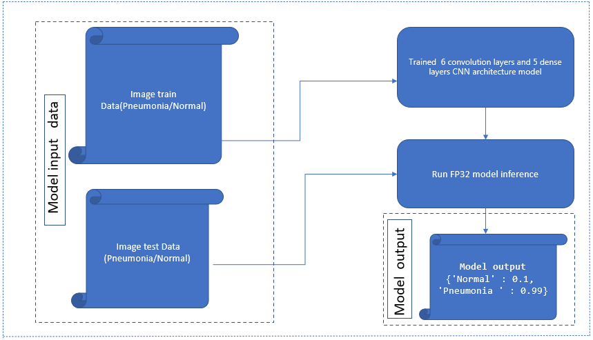

## **Application of AI in image-base abnormalities for different diseases classification using TensorFlow**

## Introduction

In this refkit we highlighted the advantages of using Intel® OneAPI packages specially TensorFlow* Optimizations from Intel, and Intel® Distribution for Python*. <br>

In this refkit we use a CNN model architecture for image classification based on a dataset form healthcare domain. The CNN-based model is a promising method to diagnose the disease through X-ray images. In this case, X-ray images used for the diagnosis of pneumonia.

Model has been quantized using Intel® Neural Compressor, which has shown high performance vectorized operations on Intel platforms.

Check out more workflow examples in the [Developer Catalog](https://developer.intel.com/aireferenceimplementations).

## **Table of Contents**
 - [Introduction](#introduction)
 - [Solution Technical Overview](#solution-technical-overview)
 - [Validated Hardware Details](#validated-hardware-details)
 - [How it Works](#how-it-works)
 - [Get Started](#get-started)
 - [Download the dataset](#download-the-dataset)
 - [Supported Runtime Environment](#supported-runtime-environment)
	- [Run Using Bare Metal](#run-using-bare-metal)
	- [Run Using Docker](#run-using-docker)
 - [Summary and Next Steps](#summary-and-next-steps)
 - [Learn More](#learn-more)
 - [Support](#support)
 - [Appendix](#appendix)

## Solution Technical Overview

Medical diagnosis of image-base abnormalities for different diseases classification is the process of determining the abnormality or condition explains a person's symptoms and signs. It is most often referred to as diagnosis with the medical context being implicit.
Images are a significant component of the patient’s electronic healthcare record (EHR) and are one of the most challenging data sources to analyze as they are unstructured. As the number of images that require analysis and reporting per patient is growing, global concerns around shortages of radiologists have also been reported. AI-enabled diagnostic imaging aid can help address the challenge by increasing productivity, improving diagnosis and reading accuracy (e.g., reducing missed findings or false negatives), improving departmental throughput, and helping to reduce clinician burnout.

The most common and widely adopted application of AI algorithms in medical image diagnosis is in the classification of abnormalities. With the use of machine learning (ML) and deep learning, the AI algorithm identifies images within a study  that warrants further attention by the radiologist/reader to classify the diseases. This aids in reducing the read time as it draws the reader’s attention to the specific image and identifies abnormalities.

X-ray images are critical in the detection of lung cancer, pneumonia, certain tumors, abnormal masses, calcifications, etc. In this reference kit, we demonstrate the detection of pneumonia using X-ray images and how a CNN model architecture can help identify and localize pneumonia in chest X-ray (CXR) images, using Intel® OneAPI packages specially TensorFlow* Optimizations from Intel, and Intel® Distribution for Python*.

The experiment aims to classify pneumonia x-ray images to detect abnormalities from the normal lung images. The goal to improve latency, throughput (Frames/sec), and accuracy of the abnormality detection by training a CNN model in batch and inference in real-time. Hyperparameter tuning is applied at training for further optimization. <br>

Since GPUs are the natural choice for deep learning and AI processing to achieve a higher FPS rate but they are also very expensive and memory consuming, the experiment applies model quantization to speed up the process using CPU, whilst reaching the standard FPS for these types of applications to operate, to show a more cost-effective option using Intel® Neural Compressor, which has shown high performance vectorized operations on Intel platforms. When it comes to the deployment of this model on edge devices, with less computing and memory resources, the experiment applies further quantization and compression to the model whilst keeping the same level of accuracy showing a more efficient utilization of underlying computing resources. <br>

The solution contained in this repo uses the following Intel® packages:

> - **Intel® Distribution for Python***
>
>   The [Intel® Distribution for Python*](https://www.intel.com/content/www/us/en/developer/tools/oneapi/distribution-for-python.html#gs.52te4z) provides:
>
>   - Scalable performance using all available CPU cores on laptops, desktops, and powerful servers
>   - Support for the latest CPU instructions
>   - Near-native performance through acceleration of core numerical and machine learning packages with libraries like the Intel® oneAPI Math Kernel Library (oneMKL) and Intel® oneAPI Data Analytics Library
>   - Productivity tools for compiling Python code into optimized instructions
>   - Essential Python bindings for easing integration of Intel® native tools with your Python* project
>
> - **Intel® Optimization for TensorFlow\***
>
>   The [Intel® Optimization for TensorFlow\*](https://www.intel.com/content/www/us/en/developer/tools/oneapi/optimization-for-tensorflow.html):
>
>   - Accelerate AI performance with Intel® oneAPI Deep Neural Network Library (oneDNN) features such as graph optimizations and memory pool allocation.
>   - Automatically use Intel® Deep Learning Boost instruction set features to parallelize and accelerate AI workloads.
>   - Reduce inference latency for models deployed using TensorFlow Serving*.
>   - Starting with TensorFlow* 2.9, take advantage of oneDNN optimizations automatically.
>   - Enable optimizations by setting the environment variable TF_ENABLE_ONEDNN_OPTS=1 in TensorFlow* 2.5 through 2.8.
>
> - **Intel® Neural Compressor\***
>
>   The [Intel® Neural Compressor\*](https://github.com/intel/neural-compressor) aims to provide popular model compression techniques such as quantization, pruning (sparsity), distillation, and neural architecture search on mainstream frameworks such as TensorFlow*, PyTorch, ONNX Runtime, and MXNet, as well as Intel extensions such as Intel® Extension for TensorFlow* and Intel® Extension for PyTorch*.

## Validated Hardware Details

| Recommended Hardware
| ----------------------------
| CPU: Intel® 2th Gen Xeon® Platinum 8280 CPU @ 2.70GHz or higher
| RAM: 187 GB
| Recommended Free Disk Space: 20 GB or more

Code was tested on Ubuntu\* 22.04 LTS.

## How it Works

### Use Case E2E flow



### Expected Input-Output

**Input**                                 | **Output** |
| :---: | :---: |
| X-ray Imaged data (Normal and Infected)          |  Disease classification

**Example Input**                                 | **Example Output** |
| :---: | :---: |
| <b>X ray Imaged data based on patient's complain <br></b> Fast breathing, shallow breathing, shortness of breath, or wheezing, Patient reports pain in throat, chest pain. fever and loss of appetite over  the last few days. | {'Normal': 0.1, 'Pneumonia ': 0.99}

### Dataset

The dataset is downloaded from [1] Kaggle* and is composed of 5,863 images (JPEG) divided into 2 categories: Normal and Pneumonia. In addition, it is already divided into 3 folders: train, test and val (follow this [link](#legal_disclaimer) to read the legal disclaimer). Also the case Studio and Repo, can be found at [2].

### Use Case E2E Architecture


## Get Started

### Download the Workflow Repository

Define an environment variable that will store the workspace path and will be used for all the commands executed using absolute paths:

[//]: # (capture: baremetal)
```bash
export WORKSPACE=$PWD/medical-imaging-diagnostics
export DATA_DIR=$WORKSPACE/data/chest_xray
export OUTPUT_DIR=$WORKSPACE/output
```

Create the working directory and clone the [Main Repository](https://github.com/intel-innersource/frameworks.ai.platform.sample-apps.medical-imaging-diagnostics/tree/main) into the working directory:

[//]: # (capture: baremetal)
```bash
mkdir -p $WORKSPACE && cd $WORKSPACE
```

```bash
git clone https://github.com/intel-innersource/frameworks.ai.platform.sample-apps.medical-imaging-diagnostics.git $WORKSPACE
```

### Set up Conda*

```bash
# Download the latest Miniconda installer for linux
wget -q https://repo.anaconda.com/miniconda/Miniconda3-latest-Linux-x86_64.sh
# Install 
bash Miniconda3-latest-Linux-x86_64.sh
# Clean downloaded file
rm Miniconda3-latest-Linux-x86_64.sh
```

To learn more about installing Conda, see the [Conda Linux installation instructions](https://docs.conda.io/projects/conda/en/stable/user-guide/install/linux.html).

## Set Up Environment

The conda yaml dependencies are kept in $WORKSPACE/env/intel_env.yml:

| **Package**                | **Version**
| :---                       | :---
| Neural-compressor          | neural-compressor==2.2
| Numpy                      | numpy=1.22.3
| Opencv-python              | opencv=4.7.0
| TensorFlow                 | intel-tensorflow=2.13.0

Follow the next steps for setup the conda environment:

```bash
conda install -n base conda-libmamba-solver
conda config --set solver libmamba
conda env create -f $WORKSPACE/env/intel_env.yml --no-default-packages
conda activate medical-image-diag-tf
```

Setting up the environment is only needed once. This step does not clean up the existing environment with the same name, so we need to make sure there is no conda environment with the same name. This will create a new conda environment with the dependencies listed in the YAML configuration.

## Download the dataset

| **Use case** | Automated methods to detect and classify Pneumonia diseases from medical images
| :--- | :---
| **Object of interest** | Medical diagnosis healthcare Industry
| **Size** | Total 5856 Images Pneumonia and Normal <br>
| **Train: Test Split** | 90:10

### Dataset preparation

> Chest X-Ray Images (Pneumonia) is downloaded and prepared by extracted in a <b>data <b> folder before running the training python module.

[//]: # (capture: baremetal)
```bash
# Navigate to inside the data folder
cd $WORKSPACE/data
# Download the data
wget -q https://s3.eu-central-1.amazonaws.com/public.unit8.co/data/chest_xray.tar.gz
# Uncompress the files
tar -xf chest_xray.tar.gz 
```

 >**Note**: Make sure "chest_xray" folder should be inside "data" folder  
 scripts have been written in such folder structure.

<br>Folder structure Looks as below after extraction of dataset.</br>

```
- data
    - chest_xray
        - train
            - NORMAL
            - PNEUMONIA
        - test
            - NORMAL
            - PNEUMONIA
        - val
            - NORMAL
            - PNEUMONIA
```

## Supported Runtime Environment

This reference kit offers two options for running the fine-tuning and inference processes:

- [Bare Metal](#run-using-bare-metal)
- [Docker](#run-using-docker)

## Run Using Bare Metal

>Follow these instructions to set up and run this workflow on your own development system. For running a provided Docker image with Docker*, see the [Docker instructions](#run-using-docker).

## Set Up and run Workflow
Below are the steps to reproduce the results given in this repository

1. Training CNN model
2. Hyperparameter tuning
3. Model Inference
4. Quantize trained models using INC and benchmarking

### 1. Training CNN model

<br>Run the training module as given below to start training and prediction using the active environment. This module takes option to run the training.

```bash
usage: medical_diagnosis_initial_training.py  [--datadir] 

optional arguments:
  -h,                   show this help message and exit
  
  --data_dir 
                        Absolute path to the data folder containing
                        "chest_xray" and "chest_xray" folder containing "train" "test" and "val" 
                         and each subfolders contain "Pneumonia" and "NORMAL" folders 
```

**Command to run training**

[//]: # (capture: baremetal)
```bash
cd $WORKSPACE
python src/medical_diagnosis_initial_training.py  --datadir $DATA_DIR
```

By default, model checkpoint will be saved in "output" folder.

> **Note**:  If any gcc dependency comes please upgrade it using sudo apt install build-essential.
Above training command will run in Intel environment and the output trained model would be saved in TensorFlow* checkpoint format.

### 2. Hyperparameter tuning

<br> Dataset remains same with 90:10 split for Training and testing. It needs to be ran multiple times on the same dataset, across different hyper-parameters

Below parameters been used for tuning
<br>- "learning rates"      : [0.001, 0.01]
<br>- "batchsize"           : [10,20]

```
usage: medical_diagnosis_hyperparameter_tuning.py 

optional arguments:
  -h,                   show this help message and exit
  

  --data_dir 
                        Absolute path to the data folder containing
                        "chest_xray" and "chest_xray" folder containing "train" "test" and "val" 
                         and each subfolders contain "Pneumonia" and "NORMAL" folders

```
**Command to run hyperparameter tuning**

[//]: # (capture: baremetal)
```bash
python src/medical_diagnosis_hyperparameter_tuning.py --datadir  $DATA_DIR
```

By default, model checkpoint will be saved in "output" folder.

> **Note**: Here using --codebatchsize 20 and  --learningRate 0.001 best accuracy has been evaluated, even that model is compatible for INC conversion

<br>**Convert the model to frozen graph**

Run the conversion module to convert the TensorFlow* checkpoint model format to frozen graph format. This frozen graph can be later used for Inferencing and Intel® Neural Compressor.

```
usage: python src/model_conversion.py [-h] [--model_dir] [--output_node_names]

optional arguments:
  -h  
                            show this help message and exit
  --model_dir
                            Please provide the Latest Checkpoint path e.g for
                            "./output"...Default path is mentioned

  --output_node_names       Default name is mentioned as "Softmax"
```

**Command to run conversion**

[//]: # (capture: baremetal)
```bash
python src/model_conversion.py --model_dir $OUTPUT_DIR --output_node_names Softmax
```

> **Note**: We need to make sure Intel frozen_graph.pb gets generated using Intel model files only

### 3. Inference

Performed inferencing on the trained model using TensorFlow* 2.13.0 with oneDNN

#### Running inference using TensorFlow*

```bash
usage: inference.py [--codebatchsize ] [--modeldir ]

optional arguments:
  -h,                       show this help message and exit

  --codebatchsize           --codebatchsize
                              batchsize used for inference
                        
  --modeldir                --modeldir         
                              provide frozen Model path ".pb" file...users can also
                              use INC INT8 quantized model here

```
**Command to run inference**

[//]: # (capture: baremetal)
```bash
OMP_NUM_THREADS=4 KMP_BLOCKTIME=100 python src/inference.py --codebatchsize 1  --modeldir $OUTPUT_DIR/updated_model.pb
```

>**Note** : Above inference script can be run in Intel environment using different batch sizes.<br>

### 4. Quantize trained models using Intel® Neural Compressor

Intel® Neural Compressor is used to quantize the FP32 Model to the INT8 Model. Optimized model is used here for evaluating and timing Analysis.
Intel® Neural Compressor supports many optimization methods. In this case, we used post training quantization with `Default Quantiztion Mode` method to quantize the FP32 model.

>**Note**: We need to make sure Intel frozen_graph.pb gets generated using Intel model files only. We recommend initiate running hyperparametertuning script with default parameter to get a new model then convert to Frozen graph and using that get the compressed model, if model gets corrupted for any reason below script will not run.

*Step-1: Conversion of FP32 Model to INT8 Model*

```bash
usage: src/INC/neural_compressor_conversion.py  [--modelpath] $OUTPUT_DIR/updated_model.pb  [--outpath] $OUTPUT_DIR/output/compressedmodel.pb [--config]  ./src/INC/deploy.yaml

optional arguments:
  -h                          show this help message and exit

  --modelpath                 --modelpath 
                                Model path trained with TensorFlow ".pb" file
  --outpath                   --outpath 
                                default output quantized model will be save in ".model//output" folder
  --config                    --config 
                                Yaml file for quantizing model, default is "./deploy.yaml"
  
```

**Command to run the neural_compressor_conversion**

[//]: # (capture: baremetal)
```bash
 python src/INC/neural_compressor_conversion.py  --modelpath  $OUTPUT_DIR/updated_model.pb  --outpath $OUTPUT_DIR/output/compressedmodel.pb  --config  ./src/INC/deploy.yaml
```

> Quantized model will be saved by default in `output/output` folder as `compressedmodel.pb`

*Step-2: Inferencing using quantized Model*

```bash
usage: inference_inc.py [--codebatchsize ] [--modeldir ]

optional arguments:
  -h,                       show this help message and exit

  --codebatchsize           --codebatchsize
                              batchsize used for inference
                        
  --modeldir                --modeldir         
                              provide frozen Model path ".pb" file...users can also
                              use INC INT8 quantized model here
```

**Command to run inference**

[//]: # (capture: baremetal)
```bash
OMP_NUM_THREADS=4 KMP_BLOCKTIME=100 python src/INC/inference_inc.py --codebatchsize 1  --modeldir $OUTPUT_DIR/updated_model.pb
```

>**Note** : Above inference script can be run in Intel environment using different batch sizes.<br>
Same script can be used to benchmark INC INT8 Quantized model. For more details please refer to INC quantization section. By using different batch size one can observe the gain obtained using Intel® oneDNN optimized TensorFlow* in Intel environment. <br>

Run this script to record multiple trials and the minimum value can be calculated.

*Step-3 : Performance of  quantized Model*

```bash
usage: 
src/INC/run_inc_quantization_acc.py  [--datapath]  [--fp32modelpath]  [--config]   

or

src/INC/run_inc_quantization_acc.py  [--datapath]  [--int8modelpath]  [--config]
   
optional arguments:
  -h,                       show this help message and exit

  --datapath                --datapath
                              need to mention absolute path of data
                        
  ---fp32modelpath          --fp32modelpath         
                              provide frozen Model path ".pb" file...(Absolute path)

  --config                  --config        
                              provide config path...(Absolute path)

  --int8modelpath          --int8modelpath      
                             provide int8 model path ".pb" file...(Absolute path)                              
```

**Command to run Evalution of FP32 Model**

[//]: # (capture: baremetal)
```bash
python src/INC/run_inc_quantization_acc.py --datapath $DATA_DIR/val --fp32modelpath $OUTPUT_DIR/updated_model.pb --config ./src/INC/deploy.yaml
```

**Command to run Evalution of INT8 Model**

[//]: # (capture: baremetal)
```bash
python src/INC/run_inc_quantization_acc.py --datapath $DATA_DIR/val --int8modelpath $OUTPUT_DIR/output/compressedmodel.pb --config ./src/INC/deploy.yaml
```

## Clean Up Bare Metal
Follow these steps to restore your $WORKSPACE directory to an initial step. Please note that all downloaded dataset files, conda environment, and logs created by workflow will be deleted. Before executing next steps back up your important files:

```bash
conda deactivate
conda env remove -n medical-image-diag-tf
```

[//]: # (capture: baremetal)
```bash
rm -rf $DATA_DIR/*
rm -rf 
```

## Remove repository

[//]: # (capture: baremetal)
```bash
rm -rf $WORKSPACE
```

## Run Using Docker*

Follow these instructions to set up and run our provided Docker* image. For running on bare metal, see the bare metal instructions.

1. Set Up Docker Engine* and Docker Compose*

You'll need to install Docker Engine* on your development system. Note that while Docker Engine* is free to use, Docker Desktop* may require you to purchase a license. See the Docker Engine Server* installation instructions for details.

To build and run this workload inside a Docker* Container, ensure you have Docker Compose* installed on your machine. If you don't have this tool installed, consult the official [Docker Compose* installation documentation](https://docs.docker.com/compose/install/linux/#install-the-plugin-manually).

```sh
DOCKER_CONFIG=${DOCKER_CONFIG:-$HOME/.docker}
mkdir -p $DOCKER_CONFIG/cli-plugins
curl -SL https://github.com/docker/compose/releases/download/v2.7.0/docker-compose-linux-x86_64 -o $DOCKER_CONFIG/cli-plugins/docker-compose
chmod +x $DOCKER_CONFIG/cli-plugins/docker-compose
docker compose version
```

Set Up and Run Docker* Image

In docker folder, there is a docker-compose file to build a container quickly and easily with everything necessary to be able to build Docker* containers. The following commands will build (if not already built) the Docker* containers and images declared in the compose file. Once the building process has ended, Docker* compose will run a container with an interactive shell session. Before trying to build the containers set the ENVVARS described in Get Started.

```bash
cd $WORKSPACE/docker
docker compose -p $USER build
docker compose -p $USER run interactive
```

Once inside the interactive shell session, the user can execute the commands described in Run Using Bare Metal.

## Clean Up Docker* Containers

Stop containers created by Docker Compose* and remove them.

```bash
cd $WORKSPACE/docker
docker compose -p $USER down --remove-orphans
```

## Expected Output

A successful execution of medical_diagnosis_initial_training.py should produce results similar to those shown below:

```bash
INFO:__main__:ABS_VAL_PATH is ============================================>./data/chest_xray/val
INFO:__main__:ABS_TRAIN_PATH is ============================================>./data/chest_xray/train
INFO:__main__:ABS_TEST_PATH is ============================================>./data/chest_xray/test
INFO:__main__:Data paths exist , executing the programme
2023-09-29 17:45:43.022617: I tensorflow/compiler/mlir/mlir_graph_optimization_pass.cc:375] MLIR V1 optimization pass is not enabled
INFO:__main__:epoch in 4 we are evaluting warm up time : epoch_number -->0 
INFO:__main__:epoch in 4 we are evaluting warm up time : epoch_number -->1 
INFO:__main__:epoch in 4 we are evaluting warm up time : epoch_number -->2 
INFO:__main__:epoch in 4 we are evaluting warm up time : epoch_number -->3 
INFO:__main__:Warm Up  time in seconds --> 6.302253
INFO:__main__:epoch in 5 we are evaluting training time : epoch_number -->0 
INFO:__main__:epoch in 5 we are evaluting training time : epoch_number -->1 
INFO:__main__:epoch in 5 we are evaluting training time : epoch_number -->2 
INFO:__main__:epoch in 5 we are evaluting training time : epoch_number -->3 
INFO:__main__:epoch in 5 we are evaluting training time : epoch_number -->4 
INFO:__main__:Total training time in seconds --> 673.476682
INFO:__main__:the number of correct predcitions (TP + TN) is:196
INFO:__main__:The number of wrong predictions (FP + FN) is4
INFO:__main__:Accuracy of the model is :98.000000
```

A successful execution of medical_diagnosis_hyperparameter_tuning.py should produce results similar to those shown below, this take time:

```bash
Current fit is at  4
INFO:__main__:epoch --> 0
INFO:__main__:epoch --> 1
INFO:__main__:epoch --> 2
INFO:__main__:epoch --> 3
INFO:__main__:epoch --> 4
INFO:__main__:Total training time in seconds -->1763.169316291809 
INFO:__main__:the number of correct predcitions (TP + TN) is:196
INFO:__main__:The number of wrong predictions (FP + FN) is:4
INFO:__main__:Accuracy of the model is :98.000000
INFO:__main__:Time taken for hyperparameter tuning ->5610.670215845108
INFO:__main__:best accuracy acheived in 0.980000
INFO:__main__:best combination is (20, 0.001)
```

A successful execution of inference.py should produce results similar to those shown below:

```bash
INFO:__main__:Tensor Stats :(<tf.Tensor 'MatMul_1:0' shape=(None, 2400) dtype=float32>,)
INFO:__main__:Operation Name :LeakyRelu_13
INFO:__main__:Tensor Stats :(<tf.Tensor 'LeakyRelu_13:0' shape=(None, 2400) dtype=float32>,)
INFO:__main__:Operation Name :MatMul_2
INFO:__main__:Tensor Stats :(<tf.Tensor 'MatMul_2:0' shape=(None, 1600) dtype=float32>,)
INFO:__main__:Operation Name :LeakyRelu_14
INFO:__main__:Tensor Stats :(<tf.Tensor 'LeakyRelu_14:0' shape=(None, 1600) dtype=float32>,)
INFO:__main__:Operation Name :MatMul_3
INFO:__main__:Tensor Stats :(<tf.Tensor 'MatMul_3:0' shape=(None, 800) dtype=float32>,)
INFO:__main__:Operation Name :LeakyRelu_15
INFO:__main__:Tensor Stats :(<tf.Tensor 'LeakyRelu_15:0' shape=(None, 800) dtype=float32>,)
INFO:__main__:Operation Name :MatMul_4
INFO:__main__:Tensor Stats :(<tf.Tensor 'MatMul_4:0' shape=(None, 64) dtype=float32>,)
INFO:__main__:Operation Name :LeakyRelu_16
INFO:__main__:Tensor Stats :(<tf.Tensor 'LeakyRelu_16:0' shape=(None, 64) dtype=float32>,)
INFO:__main__:Operation Name :MatMul_5
INFO:__main__:Tensor Stats :(<tf.Tensor 'MatMul_5:0' shape=(None, 2) dtype=float32>,)
INFO:__main__:Operation Name :Softmax
INFO:__main__:Tensor Stats :(<tf.Tensor 'Softmax:0' shape=(None, 2) dtype=float32>,)
2023-09-29 19:38:16.884707: I tensorflow/compiler/mlir/mlir_graph_optimization_pass.cc:375] MLIR V1 optimization pass is not enabled
INFO:__main__:Time taken for inference : 0.012781
```

A successful execution of neural_compressor_conversion.py should produce results similar to those shown below:

```bash
2023-09-29 19:40:21 [WARNING] All replaced equivalent node types are {}
2023-09-29 19:40:21 [INFO] Pass StripEquivalentNodesOptimizer elapsed time: 38.43 ms
2023-09-29 19:40:22 [INFO] Pass PostCseOptimizer elapsed time: 782.89 ms
2023-09-29 19:40:22 [INFO] Pass PostHostConstConverter elapsed time: 24.37 ms
2023-09-29 19:40:22 [INFO] |*Mixed Precision Statistics|
2023-09-29 19:40:22 [INFO] +------------+-------+------+
2023-09-29 19:40:22 [INFO] |  Op Type   | Total | INT8 |
2023-09-29 19:40:22 [INFO] +------------+-------+------+
2023-09-29 19:40:22 [INFO] |   MatMul   |   6   |  6   |
2023-09-29 19:40:22 [INFO] |   Conv2D   |   12  |  12  |
2023-09-29 19:40:22 [INFO] |  MaxPool   |   6   |  6   |
2023-09-29 19:40:22 [INFO] | QuantizeV2 |   19  |  19  |
2023-09-29 19:40:22 [INFO] | Dequantize |   13  |  13  |
2023-09-29 19:40:22 [INFO] +------------+-------+------+
2023-09-29 19:40:22 [INFO] Pass quantize model elapsed time: 24199.29 ms
2023-09-29 19:40:22 [INFO] Save tuning history to <PATH>/medical-imaging-diagnostics/nc_workspace/2023-09-29_19-39-09/./history.snapshot.
2023-09-29 19:40:22 [INFO] Specified timeout or max trials is reached! Found a quantized model which meet accuracy goal. Exit.
2023-09-29 19:40:22 [INFO] Save deploy yaml to <PATH>/medical-imaging-diagnostics/nc_workspace/2023-09-29_19-39-09/deploy.yaml
2023-09-29 19:40:22 [INFO] Save quantized model to <PATH>/medical-imaging-diagnostics/model/output/compressedmodel.pb.
```

A successful execution of inference_inc.py should produce results similar to those shown below:

```bash
Operation Name : MatMul_4
Tensor Stats : (<tf.Tensor 'MatMul_4:0' shape=(None, 64) dtype=float32>,)
Operation Name : LeakyRelu_16
Tensor Stats : (<tf.Tensor 'LeakyRelu_16:0' shape=(None, 64) dtype=float32>,)
Operation Name : MatMul_5
Tensor Stats : (<tf.Tensor 'MatMul_5:0' shape=(None, 2) dtype=float32>,)
Operation Name : Softmax
Tensor Stats : (<tf.Tensor 'Softmax:0' shape=(None, 2) dtype=float32>,)
Shape of input :  Tensor("Shape_1:0", shape=(4,), dtype=int32)
2023-09-29 19:41:50.033647: I tensorflow/compiler/mlir/mlir_graph_optimization_pass.cc:375] MLIR V1 optimization pass is not enabled
INFO:__main__:Time taken for inference : 0.012837
```

A successful execution of run_inc_quantization_acc.py should produce results similar to those shown below:

```bash
INFO:__main__:Evaluating the compressed Model=========================================================
2023-09-29 19:42:52 [WARNING] Force convert framework model to neural_compressor model.
2023-09-29 19:42:52 [WARNING] Output tensor names should not be empty.
2023-09-29 19:42:52 [WARNING] Input tensor names is empty.
2023-09-29 19:42:52 [INFO] Start to run Benchmark.
2023-09-29 19:42:52 [WARNING] Found possible input node names: ['Placeholder'], output node names: ['Softmax'].
2023-09-29 19:42:52 [INFO] Start to evaluate the TensorFlow model.
OMP: Info #255: KMP_AFFINITY: pid 3075279 tid 3075428 thread 1 bound to OS proc set 1
2023-09-29 19:43:02 [INFO] Model inference elapsed time: 10289.94 ms
2023-09-29 19:43:02 [INFO] 
performance mode benchmark result:
2023-09-29 19:43:02 [INFO] Batch size = 1
2023-09-29 19:43:02 [INFO] Latency: 11.679 ms
2023-09-29 19:43:02 [INFO] Throughput: 85.624 images/sec
```

## Summary and Next Steps

The experiment aims to classify pneumonia x-ray images to detect abnormalities from the normal lung images, using a CNN model arquitecture.  
The process of developing this ML pipeline can be summarised as follows:

- Setup and installation
- Download the dataset
- Train the CNN model
- Quantize trained models using INC

This process can be replicated and used as an example for other types of problems or applications in medical imaging diagnostics, such as the detection of lung cancer, certain tumors, abnormal masses, calcifications, etc.

## Learn More

For more information about AI in image-base abnormalities for different diseases classification or to read about other relevant workflow examples, see these guides and software resources:

- [Intel® AI Analytics Toolkit (AI Kit)](https://www.intel.com/content/www/us/en/developer/tools/oneapi/ai-analytics-toolkit.html)
- [Intel® Distribution for Python*](https://www.intel.com/content/www/us/en/developer/tools/oneapi/distribution-for-python.html#gs.52te4z)
- [Intel® Neural Compressor](https://www.intel.com/content/www/us/en/developer/tools/oneapi/neural-compressor.html)

## Support

The End-to-end AI in image-base abnormalities for different diseases classification team tracks both bugs and enhancement requests using [GitHub issues](https://github.com/intel-innersource/frameworks.ai.platform.sample-apps.medical-imaging-diagnostics/issues). Before submitting a suggestion or bug report, search the [DLSA GitHub issues](https://github.com/intel-innersource/frameworks.ai.platform.sample-apps.medical-imaging-diagnostics/issues) to see if your issue has already been reported.

## Appendix

### References

[1] Chest X-Ray Images (Pneumonia) dataset. Retrieved 5 October 2023, from https://www.kaggle.com/datasets/paultimothymooney/chest-xray-pneumonia<br>

[2] Image Classification With TensorFlow 2.0 ( Without Keras ). Case Study & Repo. Retrieved 5 October 2023, from https://becominghuman.ai/image-classification-with-tensorflow-2-0-without-keras-e6534adddab2

### Notices & Disclaimers

<a id="legal_disclaimer"></a>

Please see this data set's applicable license for terms and conditions. Intel® Corporation does not own the rights to this data set and does not confer any rights to it.

*Names and brands that may be claimed as the property of others. [Trademarks](https://www.intel.com/content/www/us/en/legal/trademarks.html).

Performance varies by use, configuration, and other factors. Learn more on the [Performance Index site](https://edc.intel.com/content/www/us/en/products/performance/benchmarks/overview/).

Performance results are based on testing as of dates shown in configurations and may not reflect all publicly available updates. See backup for configuration details. No product or component can be absolutely secure. Your costs and results may vary.

Intel technologies may require enabled hardware, software, or service activation.

© Intel Corporation. Intel, the Intel logo, and other Intel marks are trademarks of Intel Corporation or its subsidiaries. Other names and brands may be claimed as the property of others.
